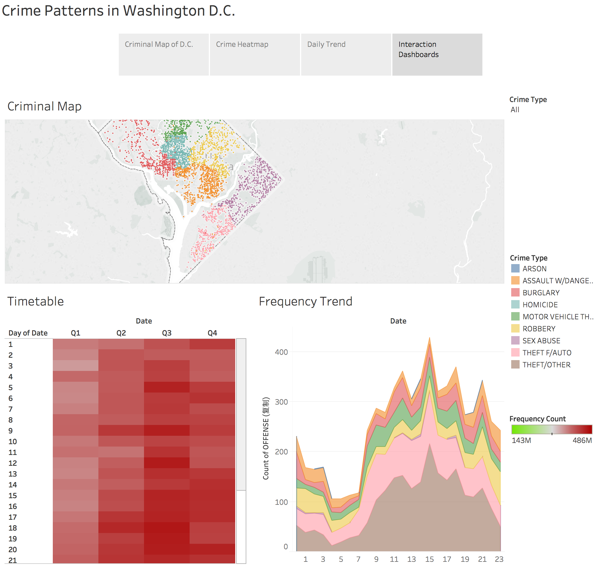

# Introduction
Washington DC is an international and historic metropolitan city that attracts millions of tourists from the world every year. As the capital of the United States, DC represents the center for politics, economy and leadership. The city has the responsibility of ensuring all tourists’ safety.  However, crimes and violence still exist and may seriously bring threats to people who are not familiar with the environment. It would be interesting to contribute to this great city from a data analytical perspective. The project targets to provide tourists valuable analysis about patterns of past crime records in order to enhance their acknowledgement of this city.

The dataset contains detailed information related to each crime record during 2008, 2014 and 2015. This project uses historical data to rank districts by safety level. Besides, it would help to locate areas that are more suitable and secured for tourists to stay. A list of tips for safety stay would be included. By comparing the historial criminal data with the recent records across different locations in DC, we would discover how the criminal rate has changed overtime. Knowing the criminal environment may also help to understand some other facts about DC. For example, the dataset may reveal some weak spots for the government and police department to pay more attention with. The goal of this project is to extract as much value as possible to improve the living environment in DC. Only when the security factors are settled, can the community make steady progress.

# Analysis

After further exploring the crime report data of DC area, we were able to build three graphs, including a dot map that pins the crime location, a heat map that shows the frequency of crime, and an area chart that presents the counts of different crimes.

