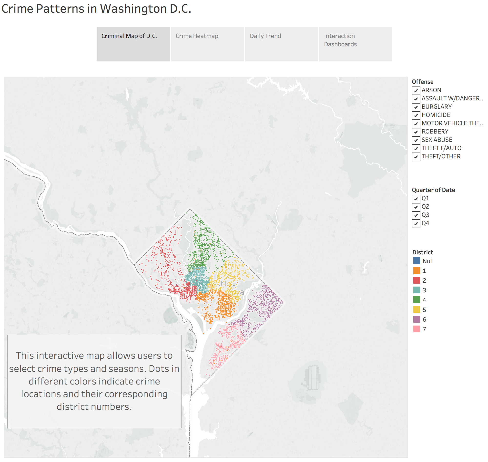
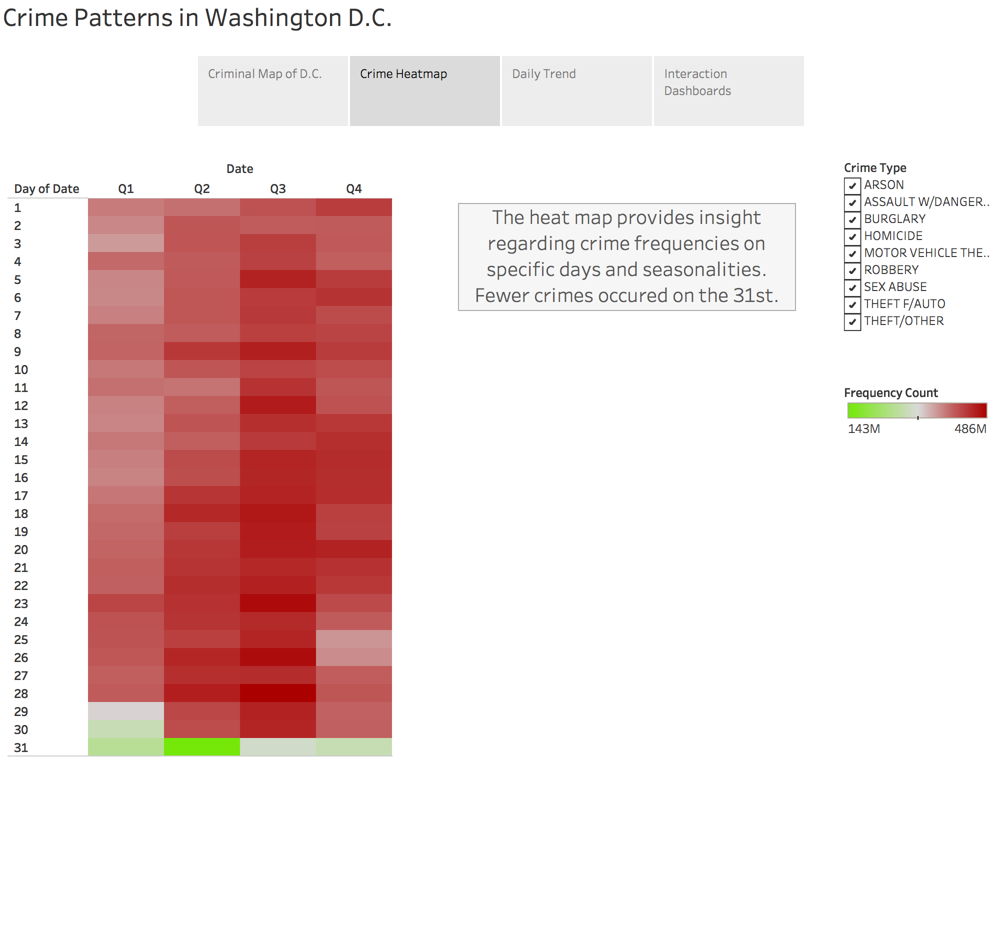
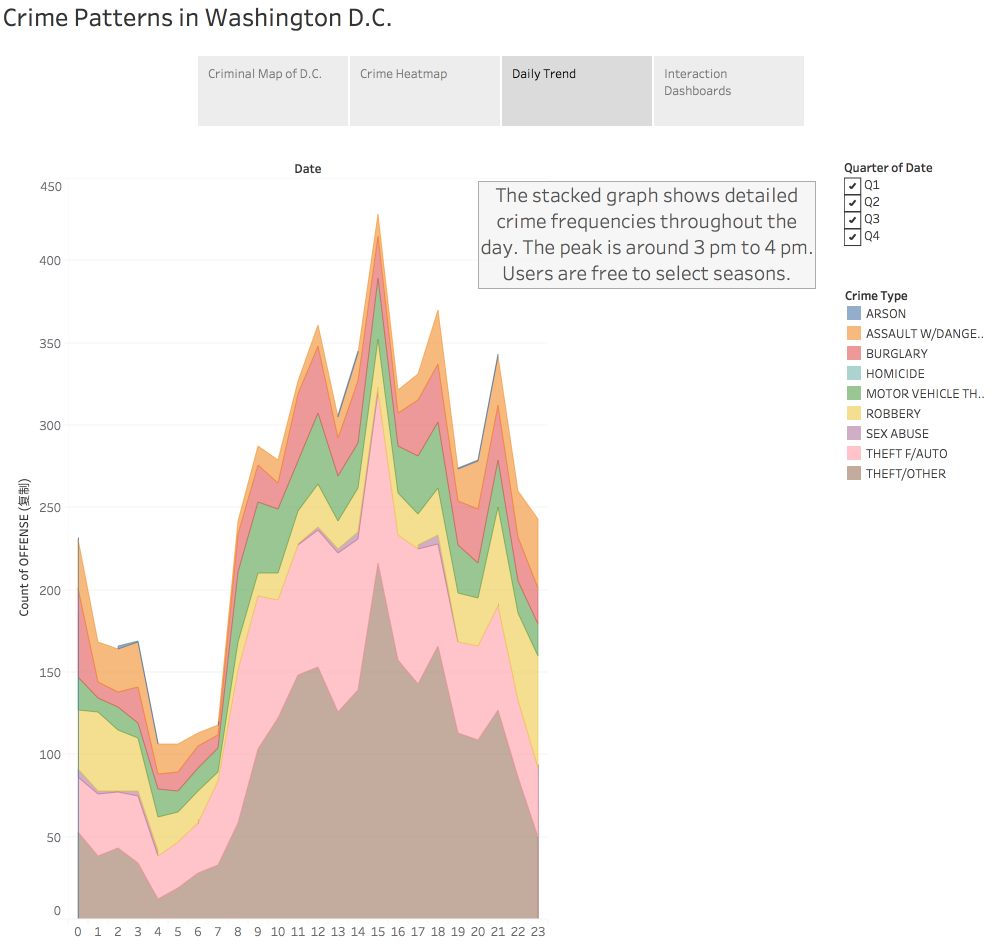

# Introduction
Washington DC is an international and historic metropolitan city that attracts millions of tourists from the world every year. As the capital of the United States, DC represents the center for politics, economy and leadership. The city has the responsibility of ensuring all tourists’ safety.  However, crimes and violence still exist and may seriously bring threats to people who are not familiar with the environment. It would be interesting to contribute to this great city from a data analytical perspective. The project targets to provide tourists valuable analysis about patterns of past crime records in order to enhance their acknowledgement of this city.

The dataset contains detailed information related to each crime record during 2008, 2014 and 2015. This project uses historical data to rank districts by safety level. Besides, it would help to locate areas that are more suitable and secured for tourists to stay. A list of tips for safety stay would be included. By comparing the historial criminal data with the recent records across different locations in DC, we would discover how the criminal rate has changed overtime. Knowing the criminal environment may also help to understand some other facts about DC. For example, the dataset may reveal some weak spots for the government and police department to pay more attention with. The goal of this project is to extract as much value as possible to improve the living environment in DC. Only when the security factors are settled, can the community make steady progress.

# Analysis

After further exploring the crime report data of DC area, we were able to build three graphs, including a dot map that pins the crime location, a heat map that shows the frequency of crime, and an area chart that presents the counts of different crimes.

As shown in the criminal map page(find link below), it is clear to see where those crimes were committed by dividing the city into districts. To further investigate the frequency of different types of occurrence in a specific location and time, it is highly suggested to use the filter bar on the side. For example, if we focus on District 3, the table shows that “assault w/dangerous weapon", "burglary", "motor vehicle theft", "robbery", and "theft" happen more frequently than other types during the entire year. Also, we realized that the blank space does not mean "pretty safe" or fewer crimes ever happened as it is the place where not so many people are currently living. For example, the yellow area may have a lower crime rate as there is an arboretum on the east side. It does not make sense to say that the yellow area is safer. 

The second figure shows the frequency of crime in DC. According to the color bar, deep red means high frequency of crime, while green means the opposite. From this heatmap, Crimes often happen in the third quarter, from July to September. Crimes are less likely to occur in the first quarter. However, since February has 29th every four years, the light grey chunk in 29th quarter one seems to be meaningless. Also, it is easy to switch to different crime types by checking or unchecking the filter on the right side. 
Therefore, we suggest all the tourists who plan to visit DC choose to arrive at the first and the second quarter. 

This table describes crime frequency based on time throughout the day. You can also choose the seasonality from the right bar. For example, if you choose the spring, it will show you the total crimes in the first season. The crime trend varies from time to time. Most crimes happen from 9am to 9pm. And the car stealing and other kind of theft comes up of a large weight of the total crime. So, it is wisely for tourists to watch out for their cars and park in appropriate locations.

# Conclusion
